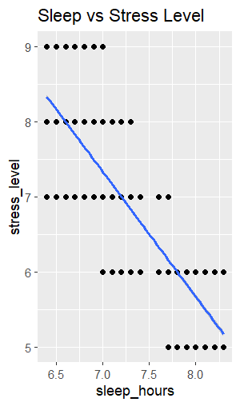
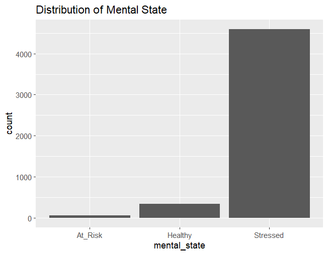
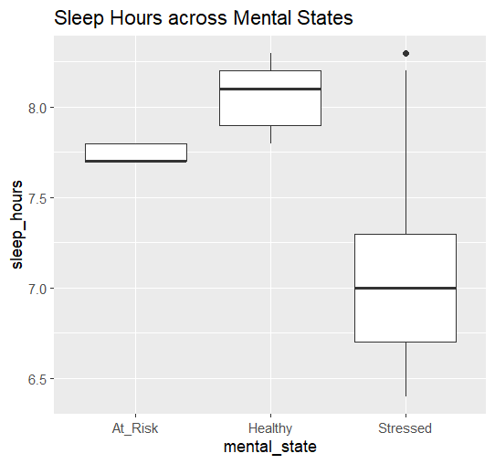

# 📊 Student Mental Health Analysis using R

## 📌 Overview

This project analyzes the impact of sleep, anxiety, and lifestyle factors on students' mental health using statistical techniques in R.

---

## 🔧 Tools & Technologies

* R Programming
* ggplot2
* Statistical Analysis

---

## 📊 Techniques Applied

* Correlation Analysis
* ANOVA (Analysis of Variance)
* Multiple Linear Regression
* Descriptive Statistics
* Data Visualization

---

## 📈 Key Insights

* Strong negative relationship between sleep and stress
* Higher anxiety observed in stressed students
* Sleep significantly impacts mental health

---

## 📊 Visualizations

### 🔹 Sleep vs Stress Relationship

---

### 🔹 Mental State Distribution

---

### 🔹 Sleep Pattern Across Mental States

---

## 📁 Files

* `analysis.R` → R code
* `mental_health_social_media_dataset.csv` → dataset

📄 Report will be added soon.

---

## 👩‍💻 Author

Paavani Kondeti
